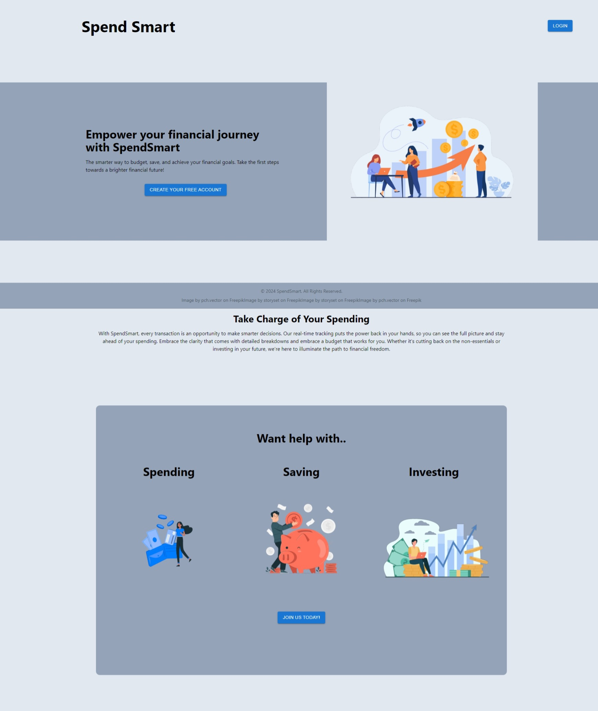
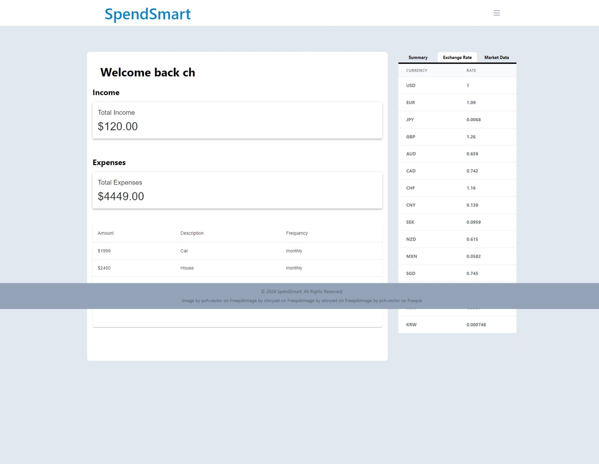
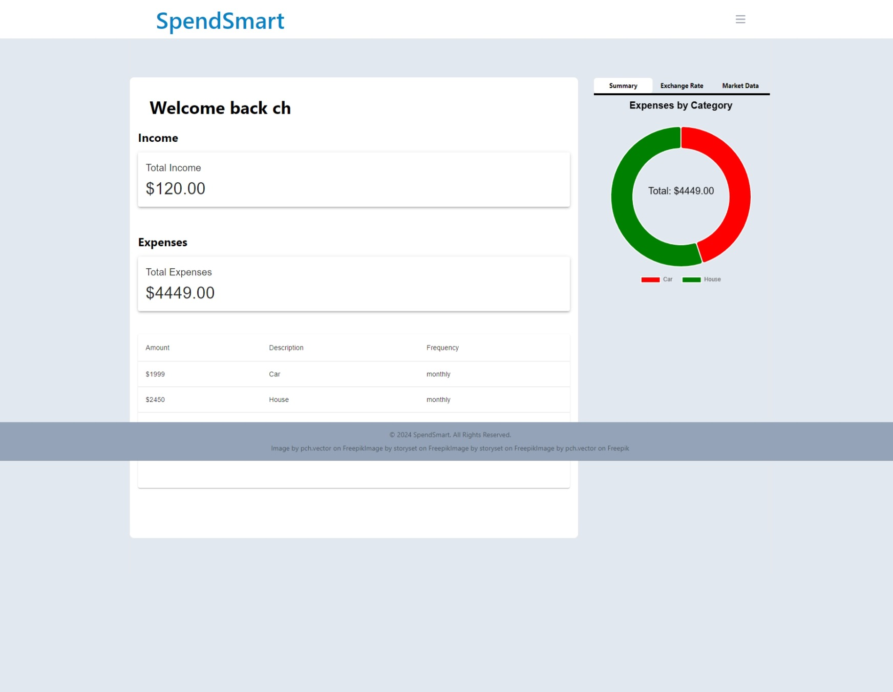

# SpendSmart

## Table of Contents
- [Introduction](#introduction)
- [Description](#description)
- [User Story](#user-story)
- [Acceptance Criteria](#acceptance-criteria)
- [Screenshot](#screenshot)
- [Links](#links)
- [Future Development](#future-development)
- [License](#license)
- [Questions](#questions)

## Description

Expense Tracker is a MERN stack single-page application designed to assist users in managing their finances effectively. It allows users to track their daily, weekly, monthly, and yearly expenses, integrating a user-friendly interface and real-time data processing. The application is built with React for the front end, GraphQL with a Node.js and Express.js server, and MongoDB along with Mongoose ODM for the database.

## User Story

```md
AS a fincancially-conscious individual, I WANT a simple and intutive application to track my expenses, SO THAT I can manage my budget more efficiently and make informed financial decisions.

```

## Acceptance Criteria

```md
Expense Tracking and Management
GIVEN a secure login page,

WHEN I enter my credentials,
THEN I am authenticated and granted access to my expense dashboard.
GIVEN the dashboard interface,

WHEN I input new expense details and submit,
THEN the expense is added to my financial records.
GIVEN existing expenses listed,

WHEN I choose to edit or delete an expense,
THEN the expense record is updated or removed accordingly.
GIVEN an option to view expenses by categories (like food, utilities, etc.),

WHEN I select a category,
THEN I see a filtered view of expenses in that category.
Data Visualization and Analysis
GIVEN a feature to visualize expenses,

WHEN I access this feature,
THEN I see graphical representations (like charts or graphs) of my expenses over time.
GIVEN an option to set a budget,

WHEN I input my monthly budget,
THEN I receive alerts or notifications if my spending approaches or exceeds this limit.
Responsiveness and Real-Time Updates
GIVEN a need to access the tracker on different devices,

WHEN I open the application on a phone, tablet, or desktop,
THEN the interface adjusts for optimal viewing and interaction.
GIVEN the real-time update feature,

WHEN I add, edit, or delete an expense,
THEN these changes are reflected immediately without needing to refresh the page.
Security and Data Protection
GIVEN the requirement to protect sensitive data,

WHEN I use the application,
THEN my financial data and API keys are securely stored and not exposed to unauthorized users.
GIVEN the application's deployment on Heroku,

WHEN I access the application online,
THEN I can use all its features as intended, with consistent performance and data integrity.

```

## Screenshot

The following image shows the Expense Tracker application's appearance and functionality:






## Links
Deployed Application: [SpendSmart Live](https://spendsmart-yq4j.onrender.com/)<br>

Github Repository: [SpendSmart Repo](https://github.com/CrisCo116/expense-tracker)

## Future Development

## License
[](https://opensource.org/licenses) This project is licensed under the MIT License.

## Questions
If you have any questions or encounter any issues, please feel free to [open an issue](https://github.com/CrisCo116/expense-tracker/issues) or contact us directly:<br>

GitHub: [Martin Estrada](https://github.com/Mxrtinee)<br>
GitHub: [Chris Lerwick](https://github.com/CrisCo116)<br>
GitHub: [Sefufim Alvarez](https://github.com/sefu-alv)<br>
GitHub: [Victor Romero Beltran](https://github.com/vromero-beltran)<br>
GitHub: [Justin Schultz](https://github.com/justin-schultz37)<br>
